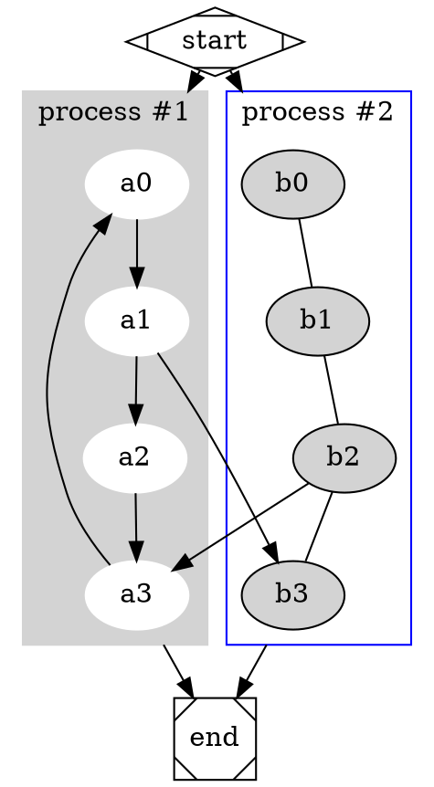
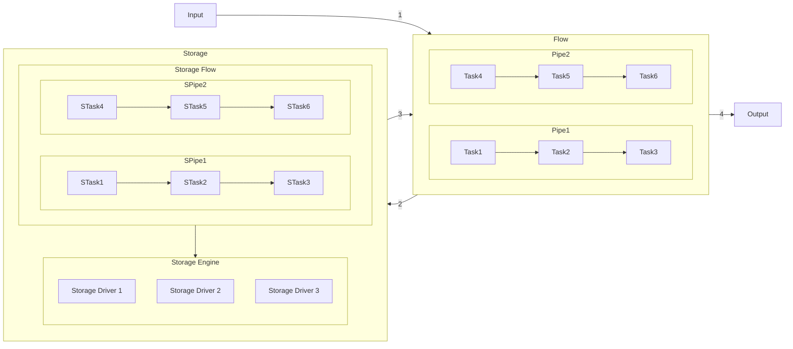

# A Utility Collection

```graphviz
digraph g {
    graph [compound=true];
    subgraph cluster0 {
        node [style=filled,color=white];
        style=filled;
        color=lightgrey;
        a0 -> a1 -> a2 -> a3;
        label="process #1";
    }

    subgraph cluster1 {
        node [style=filled];
        edge [dir=none]
        b0 -> b1 -> b2 -> b3;
        label="process #2";
        color=blue;
    }

    start -> a0 [lhead=cluster0];
    start -> b0 [lhead=cluster1];
    a1 -> b3;
    b2 -> a3;
    a3 -> a0;
    a3 -> end [ltail=cluster0];
    b3 -> end [ltail=cluster1];

    start [shape=Mdiamond];
    end [shape=Msquare];
}

```

```mermaid
flowchart LR
    subgraph F[Flow]
        direction LR
        subgraph Pipe1
            direction LR
            Task1 --> Task2 --> Task3
        end
        subgraph Pipe2
            direction LR
            Task4 --> Task5 --> Task6
        end
    end

    subgraph S[Storage]
        direction TB
        subgraph SF[Storage Flow]
            direction LR
            subgraph SP1[SPipe1]
                direction LR
                STask1 --> STask2 --> STask3
            end
            subgraph SP2[SPipe2]
                direction LR
                STask4 --> STask5 --> STask6
            end
        end
        subgraph SE[Storage Engine]
            direction TB
            SD1[Storage Driver 1]
            SD2[Storage Driver 2]
            SD3[Storage Driver 3]
        end
        SF --> SE
    end

    Input -->|1| F -->|2| S -->|3| F -->|4| Output
```
