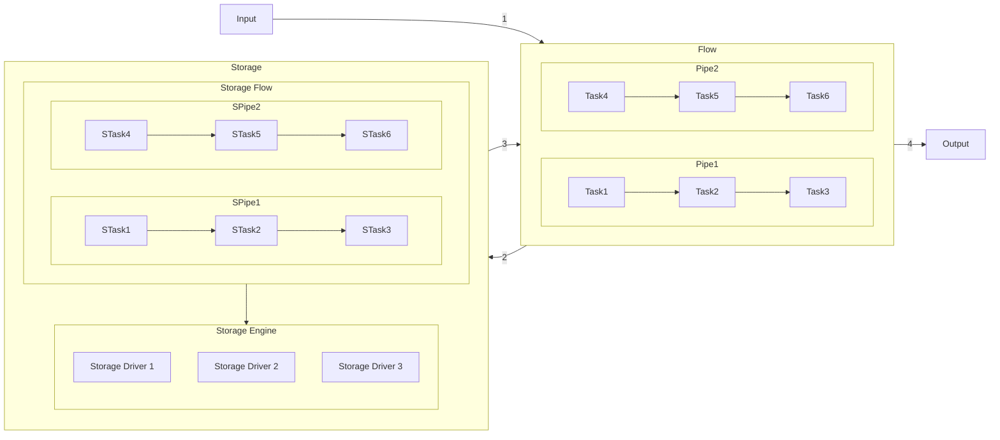

# A Utility Collection

```mermaid
flowchart LR
    subgraph F[Flow]
        direction LR
        subgraph Pipe1
            direction LR
            Task1 --> Task2 --> Task3
        end
        subgraph Pipe2
            direction LR
            Task4 --> Task5 --> Task6
        end
    end

    subgraph S[Storage]
        direction TB
        subgraph SF[Storage Flow]
            direction LR
            subgraph SP1[SPipe1]
                direction LR
                STask1 --> STask2 --> STask3
            end
            subgraph SP2[SPipe2]
                direction LR
                STask4 --> STask5 --> STask6
            end
        end
        subgraph SE[Storage Engine]
            direction TB
            SD1[Storage Driver 1]
            SD2[Storage Driver 2]
            SD3[Storage Driver 3]
        end
        SF --> SE
    end

    Input -->|1| F -->|2| S -->|3| F -->|4| Output
```

This is hi
